# Adding Nodes Outside of a MachineSet in vSphere IPI Clusters
### By: Michael McNeill
------
OpenShift 4 introduced a new paradigm for cluster installation: installer-provisioned infrastructure (also known as IPI). This full-stack automation experience works not only on public cloud providers like AWS, Azure, and Google Cloud, but also on private cloud and on-premise environments such as vSphere, OpenStack, and more. Creating a cluster with installer-provisioned infrastructure is very easy, and delegates the infrastructure bootstrapping and provisioning to the openshift-install command line utility. The installer utility creates all the networking, machines, and operating systems that are required to support the cluster. 

With all the benefits of installer-provisioned infrastructure, there is also an important drawback to consider, especially in vSphere environments: there are limited customizations allowed to the underlying virtual machines created by OpenShift. In my specific case, I needed to passthrough three different SSDs directly (via RDM in vSphere) to the underlying virtual machine to provide local backing storage for [OpenShift Container Storage](https://www.redhat.com/en/technologies/cloud-computing/openshift-data-foundation). While some of the cloud provider integrations (namely AWS) support adding additional block volumes beyond the root volume, the vSphere provider does not. In addition, editing virtual machines created by a MachineSet is not supported and can result in many additional issues. The solution to this problem is to follow a similar path as the control plane nodes: manually provision them outside of a MachineSet using the user-provisioned infrastructure (UPI) methodology. 

This blog posts walks through the addition of a node outside of a MachineSet in an existing vSphere IPI cluster. While this blog post focuses specifically on vSphere IPI clusters, the procedure is similar with other cloud providers (both public cloud and private cloud/on-premise). The procedures discussed in this blog post use OpenShift 4.7 and vSphere 6.7U3 (although vSphere 7.x should also work).

Two important notes before we begin: 

- Your additional nodes must be on the same underlying cloud provider as your IPI cluster. For example, if you are working with a vSphere IPI cluster, you must add a node that is a virtual machine in the same vSphere environment.  
- You can only add additional compute nodes in this way. Adding additional control plane nodes is not supported. 

Now that we’ve gotten that out of the way, let’s proceed with the process:

### Step 1

Extract the compute node ignition configuration. 
Ensure that you are logged into the OpenShift command line utility (the oc tools) and execute the following command:
```
oc extract -n openshift-machine-api secret/worker-user-data --keys=userData --to=- | base64
```

The output will be similar to:
```
# userData
eyJpZ25pdGlvbiI6eyJjb25maWciOnsibWVyZ2UiOlt7InNvdXJjZSI6Imh0dHBzOi8veHh4Lnh4eC54eHgueHh4OjIyNjIzL2NvbmZpZy93b3JrZXIifV19LCJzZWN1cml0eSI6eyJ0bHMiOnsiY2VydGlmaWNhdGVBdXRob3JpdGllcyI6W3sic291cmNlIjoiZGF0YTp0ZXh0L3BsYWluO2NoYXJzZXQ9dXRmLTg7YmFzZTY0LFhYWFhYWFhYWFhYWFhYWFhYWFhYWFhYWFhYWFhYWFhYWFhYWFhYWFhYWFhYWFhYWFhYWFhYWFhYWFhYWFhYWFhYWFhYWFhYWFhYWFhYWFhYWFhYWFhYWFhYWFhYWFhYWFhYWFhYWFhYWFhYWFhYWFhYWFhYWFhYWFhYWFhYWFhYWFhYWFhYWFhYWFhYWFhYWFhYWFhYWFhYWFhYWFhYWFhYWFhYWFhYWFhYWFhYWFhYWFhYWFhYWFhYWFhYWFhYWFhYWFhYWFhYWFhYWFhYWFhYWFhYWFhYWFhYWFhYWFhYWFhYWFhYWFhYWFhYWFhYWFhYWFhYWFhYWFhYWFhYWFhYWFhYWFhYWFhYWFhYWFhYWFhYWFhYWFhYWFhYWFhYWFhYWFhYWFhYWFhYWFhYWFhYWFhYWFhYWFhYWFhYWFhYWFhYWFhYWFhYWFhYWFhYWFhYWFhYWFhYWFhYWFhYWFhYWFhYWFhYWFhYWFhYWFhYWFhYWFhYWFhYWFhYWFhYWFhYWFhYWFhYWFhYWFhYWFhYWFhYWFhYWFhYWFhYWFhYWFhYWFhYWFhYWFhYWFhYWFhYWFhYWFhYWFhYWFhYWFhYWFhYWFhYWFhYWFhYWFhYWFhYWFhYWFhYWFhYWFhYWFhYWFhYWFhYWFhYWFhYWFhYWFhYWFhYWFhYWFhYWFhYWFhYWFhYWFhYWFhYWFhYWFhYWFhYWFhYWFhYWFhYWFhYWFhYWFhYWFhYWFhYWFhYWFhYWFhYWFhYWFhYWFhYWFhYWFhYWFhYWFhYWFhYWFhYWFhYWFhYWFhYWFhYWFhYWFhYWFhYWFhYWFhYWFhYWFhYWFhYWFhYWFhYWFhYWFhYWFhYWFhYWFhYWFhYWFhYWFhYWFhYWFhYWFhYWFhYWFhYWFhYWFhYWFhYWFhYWFhYWFhYWFhYWFhYWFhYWFhYWFhYWFhYWFhYWFhYWFhYWFhYWFhYWFhYWFhYWFhYWFhYWFhYWFhYWFhYWFhYWFhYWFhYWFhYWFhYWFhYWFhYWFhYWFhYWFhYWFhYWFhYWFhYWFhYWFhYWFhYWFhYWFhYWFhYWFhYWFhYWFhYWFhYWFhYWFhYWFhYWFhYWFhYWFhYWFhYWFhYWFhYWFhYWFhYWFhYWFhYWFhYWFhYWFhYWFhYWFhYWFhYWFhYWFhYWFhYWFhYWFhYWFhYWFhYWFhYWFhYWFhYWFhYWFhYWFhYWFhYWFhYWFhYWFhYWFhYWFhYWFhYWFhYWFhYWFhYWFhYWFhYWFhYWFhYWFhYWFhYWFhYWFhYWFhYWFhYWFhYWFhYWFhYWFhYWFhYWFhYWFhYWFhYWFhYWFhYWFhYWFhYWFhYWFhYWFhYWFhYWFhYWFhYWFhYWFhYWFhYWFhYWFhYWFhYWFhYWFhYWFhYWFhYWFhYWFhYWFhYWFhYWFhYWFhYWFhYWFhYWFhYWFhYWFhYWFhYWFhYWFhYWFhYWFhYWFhYWFhYWFhYWFhYWFhYWFhYWFhYWFhYWFhYWFhYWFhYWFhYWFhYWFhYWFhYWFhYWFhYWFhYWFhYWFhYWFhYWFhYWFhYWFhYWFhYWFhYWFhYWFhYWFhYWFhYWFhYWFhYWFhYWFhYWFhYWFhYWFhYWFhYWFhYWFhYWFhYWFhYWFhYWFhYWFhYWFhYWFhYWFhYWFhYWFhYWFhYWFhYWFhYWFhYWFhYWFhYWFhYWFhYWFhYWFhYWFhYWFhYWFhYWFhYWFhYWFhYWFhYWFhYWFhYWFhYWFhYWFhYWFhYWFhYWFhYWFhYWFhYWFhYWFhYWFhYWFhYWFhYWFhYWFhYWFhYWFhYWFhYWFhYWFhYWFhYWFhYWFhYWFhYWFhYWFhYWFhYWFhYWFhYWFhYWFhYWFhYWFhYWFhYWFhYWFhYWFhYWFhYWFhYWFhYWFhYWFhYWFhYWFhYWFhYWFhYWFhYWFhYWFhYWFhYWFhYWFhYWFhYWFhYWFhYWFhYWFhYWFhYWFhYWFhYWFhYWFhYWFg9PSJ9XX19LCJ2ZXJzaW9uIjoiMy4yLjAifX0iCg==
```
Make note of the base64 encoded result for use later in the process.

### Step 2

Login to vSphere and clone the rhocs virtual machine template to your new virtual machine. Ensure you are cloning ***the rhcos template that has never been started***, not another virtual machine!

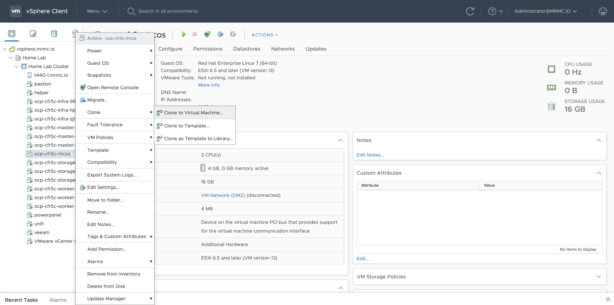

### Step 3

Enter the hostname you wish to use, in my case, I’m using the existing format: `ocp-cfr5c-test-1`. Select the folder that the existing OpenShift cluster has been installed in and select “Next”. 


### Step 4	
 
Select the vSphere cluster/machine you wish to deploy to and select “Next”.

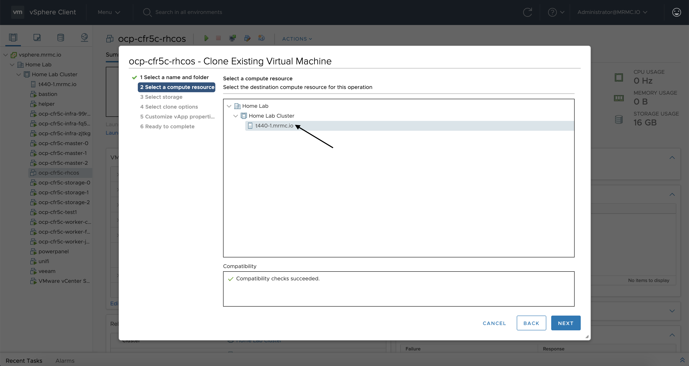
 
### Step 5

Select the datastore you wish to use for the root volume and select “Next”.

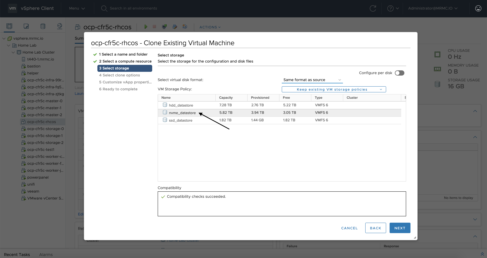
 
### Step 6

Check the “Customize this virtual machine's hardware” and the “Power on virtual machine after creation” checkboxes and select “Next”.

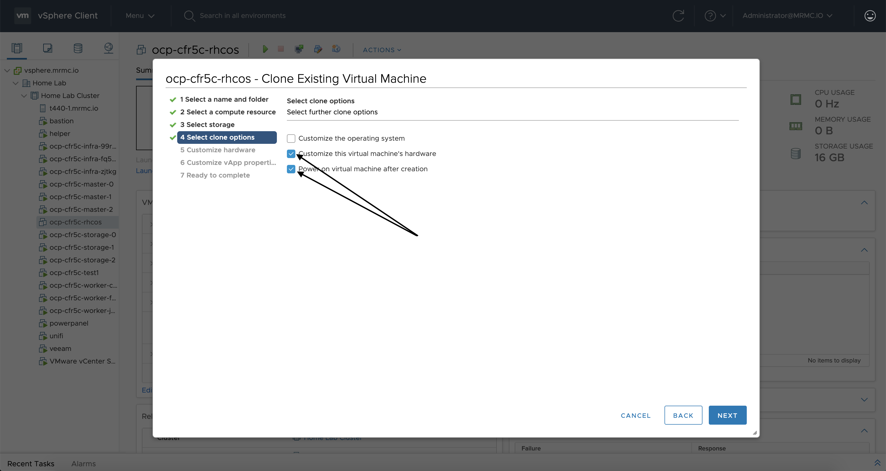
 
### Step 7

Ensure that you set the memory, CPU, and disk size to at least the minimums specified in the documentation. Make any additional changes that you need to meet your needs (for example, add a new RDM device).

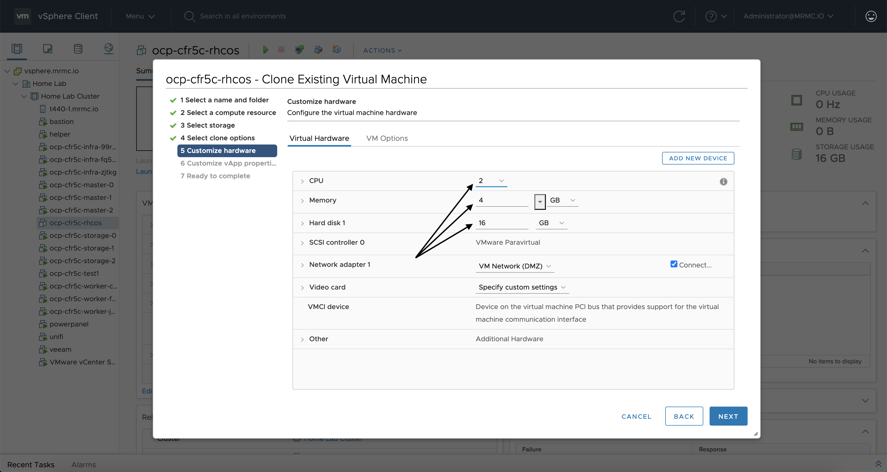

### Step 8

Select the “VM Options” tab and expand the “Advanced” tab. Select the “Edit Configuration…” button beside the “Configuration Parameters” option.

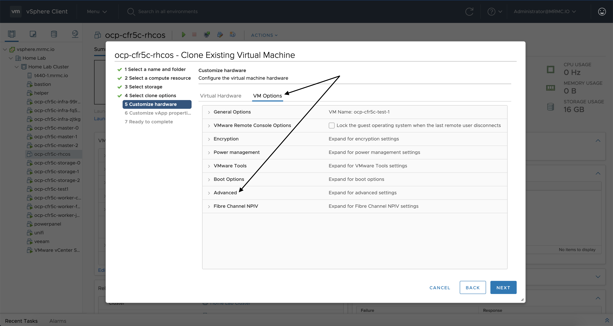
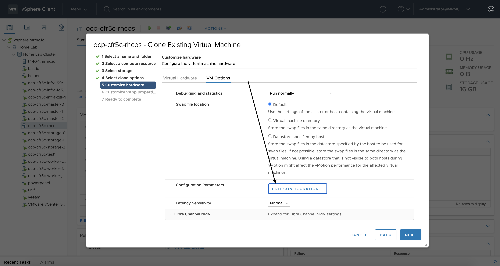

### Step 9

Hit the “Add Configuration Params” button four times to add four new configuration parameters.

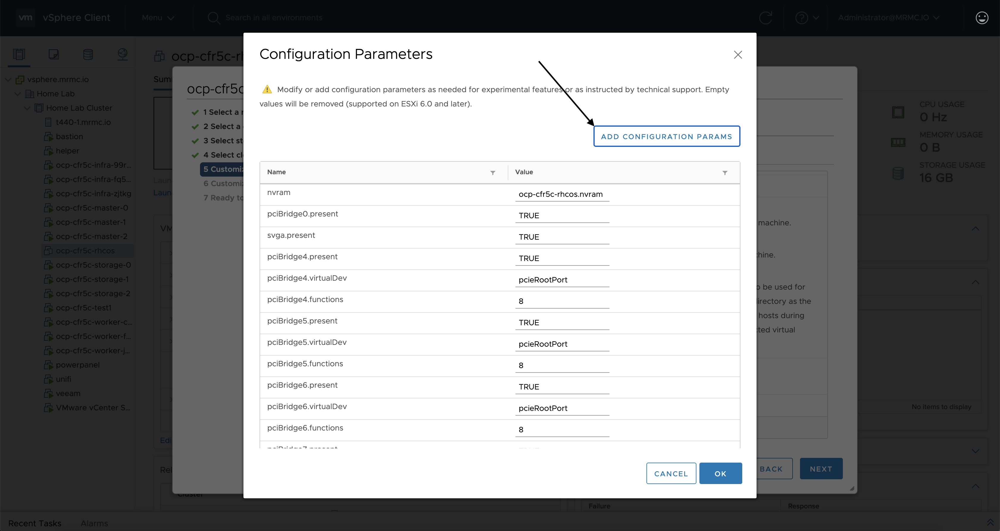

### Step 10

Add the following four parameters to the new configuration parameter blank fields and select “Ok” and then select “Next” to proceed. Ensure that you replace the content within the <> with the content specified.

| *Name* | *Value* |
| --- | --- |
| guestinfo.ignition.config.data | `<base64 output from step #1>` |
| guestinfo.ignition.config.data.encoding | `base64` |
| disk.EnableUUID | `TRUE` |
| guestinfo.afterburn.initrd.network-kargs | `ip=::::<hostname>:ens192:dhcp` |

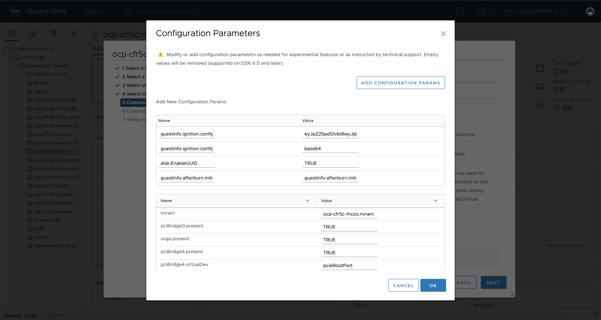
	
### Step 11

Leave the vApp properties untouched and proceed to the next screen by selecting “Next”. 

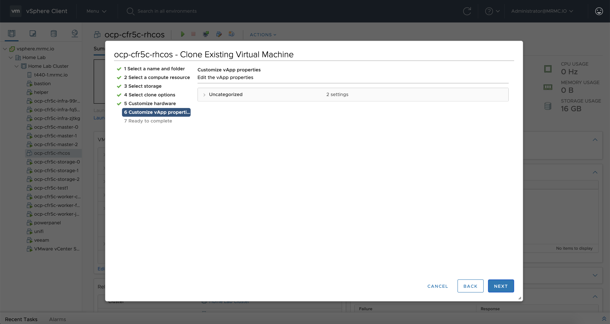
 
### Step 12
Review your creation and select “Finish” to complete the cloning process.

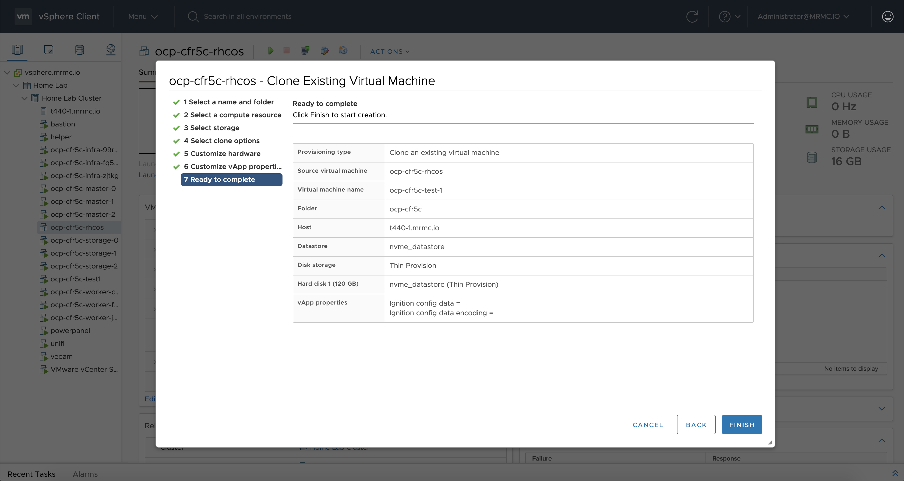
 
### Step 13
Once the machine has been successfully cloned, monitor the virtual console to ensure that the machine successfully boots to the login screen (and shows the correct hostname). 

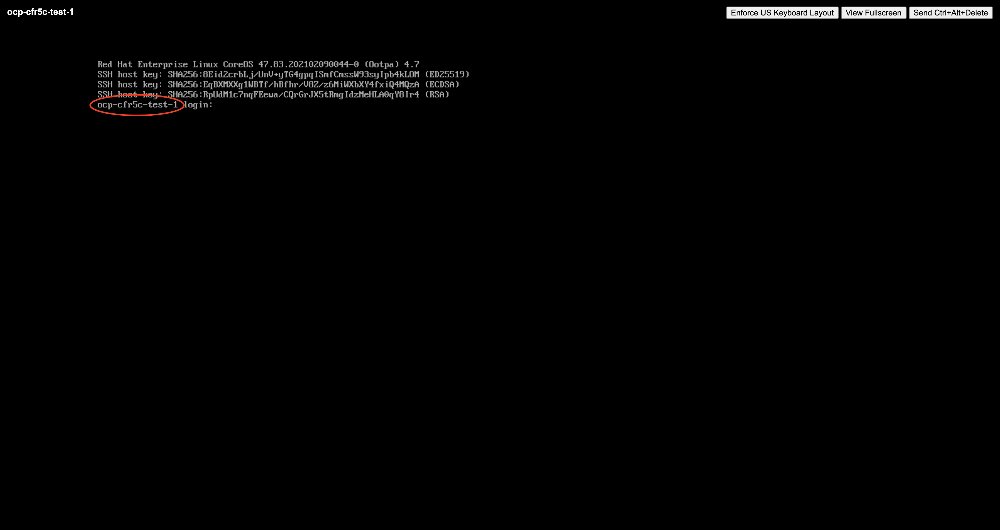
 
### Step 14
Once the machine has successfully booted and shows the proper hostname (don’t be alarmed if it reboots after successfully booting). Watch for the node-bootstraper certificate signing request to show up as pending. Note, it could take a few minutes for the CSR to be issued.
To check for the CSR, execute the following command (you may have to run it a few times):
```
oc get csr
```

The output will be similar to:
```
NAME        AGE   SIGNERNAME                                    REQUESTOR                                                                   CONDITION
csr-2s7tn   66s   kubernetes.io/kube-apiserver-client-kubelet   system:serviceaccount:openshift-machine-config-operator:node-bootstrapper   Pending
```

### Step 15

Approve the certificate signing request for the node-bootstraper by copying the name of the CSR.

To approve the CSR, execute the following command (making sure to replace the \<csr-name\> with the name of the CSR):
```
oc adm certificate approve <csr-name>
```
The output will be similar to:
```
certificatesigningrequest.certificates.k8s.io/csr-2s7tn approved
```

### Step 16

Watch again for the node’s certificate signing request to show up as pending.  
To check for the CSR, execute the following command (you may have to run it a few times):
```
oc get csr
```
The output will be similar to:
```
NAME        AGE     SIGNERNAME                                    REQUESTOR                                                                   CONDITION
csr-2s7tn   2m24s   kubernetes.io/kube-apiserver-client-kubelet   system:serviceaccount:openshift-machine-config-operator:node-bootstrapper   Approved,Issued
csr-snghc   4s      kubernetes.io/kubelet-serving                 system:node:ocp-cfr5c-test-1                                                Pending
```
### Step 17 
Approve the certificate signing request for the node itself. 

To approve the CSR, execute the following command (making sure to replace the \<csr-name\> with the name of the CSR):
```
oc adm certificate approve <csr-name>
```
The output will be similar to:
```
certificatesigningrequest.certificates.k8s.io/csr-snghc approved
```

### Step 17 

Wait for the node to become ready by watching the output of the following command:

```
oc get nodes -w
```
The output will be similar to:
```
NAME                     STATUS   ROLES            AGE     VERSION
ocp-cfr5c-infra-99rgg    Ready    infra,worker     7d4h    v1.20.0+bafe72f
ocp-cfr5c-infra-fq5bq    Ready    infra,worker     7d4h    v1.20.0+bafe72f
ocp-cfr5c-infra-zjtkg    Ready    infra,worker     6d21h   v1.20.0+bafe72f
ocp-cfr5c-master-0       Ready    master           7d6h    v1.20.0+bafe72f
ocp-cfr5c-master-1       Ready    master           7d6h    v1.20.0+bafe72f
ocp-cfr5c-master-2       Ready    master           7d6h    v1.20.0+bafe72f
ocp-cfr5c-storage-0      Ready    storage,worker   19h     v1.20.0+bafe72f
ocp-cfr5c-storage-1      Ready    storage,worker   19h     v1.20.0+bafe72f
ocp-cfr5c-storage-2      Ready    storage,worker   19h     v1.20.0+bafe72f
ocp-cfr5c-test-1         NotReady worker           34s     v1.20.0+bafe72f
ocp-cfr5c-worker-cqmgj   Ready    worker           7d6h    v1.20.0+bafe72f
ocp-cfr5c-worker-fk9qq   Ready    worker           7d6h    v1.20.0+bafe72f
ocp-cfr5c-worker-jbgwt   Ready    worker           7d6h    v1.20.0+bafe72f
ocp-cfr5c-test-1         Ready    worker           90s     v1.20.0+bafe72f
```
Once you see the node become ready, hit Control+c to kill the command. 

### Step 19

Create a Machine to describe the host for your newly created node. For the purposes of this blog, you can modify the below example, or you can create your own. 

```
apiVersion: machine.openshift.io/v1beta1
kind: Machine
metadata:
  name: ocp-cfr5c-test-1
  namespace: openshift-machine-api
  finalizers:
    - machine.machine.openshift.io
  labels:
    machine.openshift.io/cluster-api-cluster: ocp-cfr5c
    machine.openshift.io/cluster-api-machine-role: worker
    machine.openshift.io/cluster-api-machine-type: worker
    machine.openshift.io/region: ''
    machine.openshift.io/zone: ''
spec:
  metadata: {}
  providerID: null
  providerSpec:
    value:
      numCoresPerSocket: 2
      diskGiB: 120
      snapshot: ''
      userDataSecret:
        name: worker-user-data
      memoryMiB: 16384
      credentialsSecret:
        name: vsphere-cloud-credentials
      network:
        devices:
          - networkName: VM Network (DMZ)
      metadata:
        creationTimestamp: null
      numCPUs: 4
      kind: VSphereMachineProviderSpec
      workspace:
        datacenter: Home Lab
        datastore: nvme_datastore
        folder: /Home Lab/vm/ocp-cfr5c
        resourcePool: /Home Lab/host/Home Lab Cluster/Resources
        server: vsphere.example.com
      template: ocp-cfr5c-rhcos
      apiVersion: vsphereprovider.openshift.io/v1beta1
```

Modify and save this file (I'm calling it upi-machine.yaml, but you can call it whatever you'd like), then execute the following command to create it in OpenShift:
```
oc create -f upi-machine.yaml
```

The output will be similar to:
```
machine.machine.openshift.io/ocp-cfr5c-test-1 created
```

### Step 20

Finally, verify that the machine was properly configured with the VMware UUID in the `.spec.providerID` field and that the machine is annotated with the `machine.openshift.io/instance-state: poweredOn` annotation. 

To do this, execute the following command:
```
oc describe machine ocp-cfr5c-test-1 -n openshift-machine-api
```

The output will be similar to:
```
Name:         ocp-cfr5c-test-1
Namespace:    openshift-machine-api
Labels: ...
Annotations:  machine.openshift.io/instance-state: poweredOn
API Version:  machine.openshift.io/v1beta1
Kind:         Machine
Metadata: ...
Spec:
  Metadata:
  Provider ID:  vsphere://xxxxxx-xxxx-xxxx-xxxx-xxxxxxxxxxxx
  Provider Spec: ...
Status:
  Addresses:
    Address:     xxx.xxx.xxx.xxx
    Type:        InternalIP
    Address:     xxxx::xxxx:xxxx:xxxx:xxxx
    Type:        InternalIP
    Address:     ocp-cfr5c-test-1
    Type:        InternalDNS
  Last Updated:  2021-04-14T22:26:52Z
  Node Ref:
    Kind:  Node
    Name:  ocp-cfr5c-test-1
    UID:   xxxxxx-xxxx-xxxx-xxxx-xxxxxxxxxxxx
  Phase:   Running
  Provider Status:
    Conditions:
      Last Probe Time:       2021-04-14T22:26:52Z
      Last Transition Time:  2021-04-14T22:26:52Z
      Message:               Machine successfully created
      Reason:                MachineCreationSucceeded
      Status:                True
      Type:                  MachineCreation
    Instance Id:             xxxxxx-xxxx-xxxx-xxxx-xxxxxxxxxxxx
    Instance State:          poweredOn
Events:
  Type    Reason  Age                    From               Message
  ----    ------  ----                   ----               -------
  Normal  Update  2m42s (x6 over 6m17s)  vspherecontroller  Updated Machine ocp-cfr5c-test-1

```

Congratulations: you've successfully added a machine outside of a MachineSet in OpenShift! It is ready for workloads to be scheduled to it or further customizations. Big thanks to Katherine Dubé for stating that this was possible on the [Ask an OpenShift Admin Office Hour](https://www.openshift.com/blog/ask-an-openshift-admin-office-hour-installation-methods-redux) and Andrew Sullivan and Christian Hernandez for helping me get the process working. 
